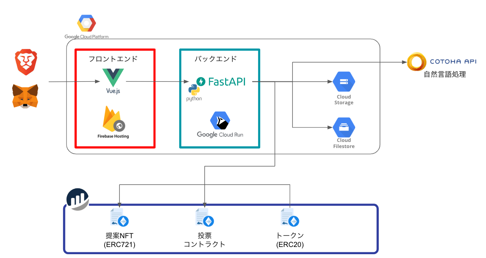

# innovation-support-smartcontract

TOYOTAWeb3 ハッカソンで開発した、イノベーションサポートで利用するスマートコントラクトです。

イノサポのサービスには下記の URL からアクセスしてください

- [イノサポ - InnovationSupport](https://innovation-support-d391e.web.app)

  

## 全体像

イノベーションサポートの全体像は下記の図の通りです。本リポジトリはそのうちの、青枠の「スマートコントラクト」のソースコードです。

その他のソースコードはそれぞれ、下記のリポジトリを確認してください

- 赤枠 - フロントエンド
  - [GitHub - teritamas/innovation-support-frontend](https://github.com/teritamas/innovation-support-frontend)
- 緑枠 - バックエンド
  - [GitHub - teritamas/innovation-support-backend](https://github.com/teritamas/innovation-support-backend)

## デプロイ方法

本リポジトリのソースコードを、任意のネットワークにデプロイすることで、スマートコントラクトの機能を利用することができます。

下記の手順は RemixIDE を利用してでプロイする手順です。

1. [Remix](https://remix.ethereum.org/#lang=en&optimize=false&runs=200&evmVersion=null&version=soljson-v0.8.18+commit.87f61d96.js)で本リポジトリを Clone する。
2. `InnovationSupportFT.sol`、`ProposalNFT.sol`をデプロイする
3. `InnovationSupportFT.sol`、`ProposalNFT.sol`で`transferOwnership`実行し、所有者をイノベーションサポートの管理者ウォレットに変更する。
4. `ProposalVote.sol`をデプロイする
5. `ProposalVote.sol`の下記の関数をそれぞれ実行し、`InnovationSupportFT.sol`、`ProposalNFT.sol`を紐づける
   - `setNftContractAddress(${ProposalNFT.solのコントラクトアドレス})`
   - `setERC20ContractAddress(${InnovationSupportFT.solのコントラクトアドレス})`

## 各コントラクトの概要

本リポジトリに含まれる各コントラクトの概要です。

### `InnovationSupportFT.sol`

イノベーションサポートで通貨として利用できるトークンの発行、移転、償却を行うコントラクト。ERC20 を遵守している。

### `ProposalNFT.sol`

イノベーションサポート上で投稿した提案内容とその提案で得たい資金調達額を、NFT 化するコントラクト。ERC721 を遵守している。

### `ProposalVote.sol`

`ProposalNFT`と`InnovationSupportFT.sol`（ERC20）と連携し、NFT に対する投票処理と、NFT の所有者に投票結果に応じてトークンを支払う。支払うトークンは ERC20 のトークンであれば、任意のトークンを発行可能です。
